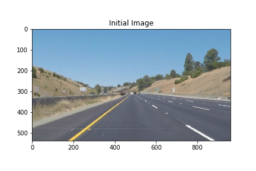
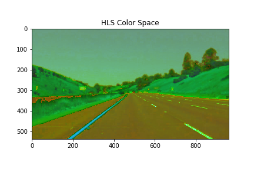
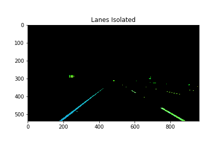
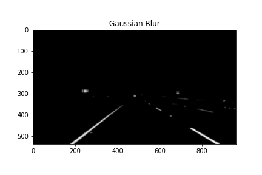
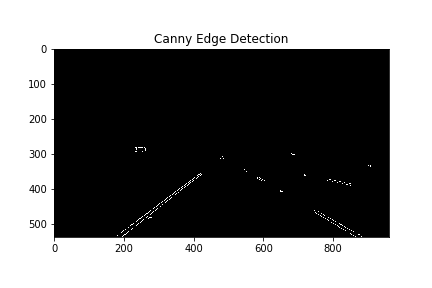
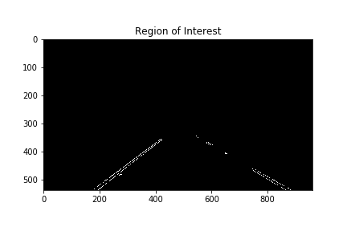
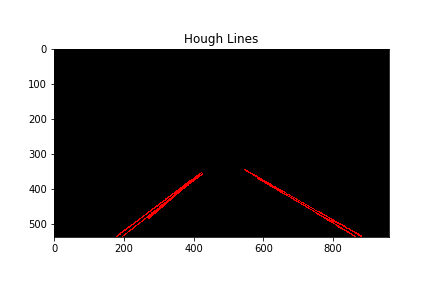
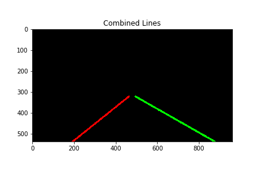
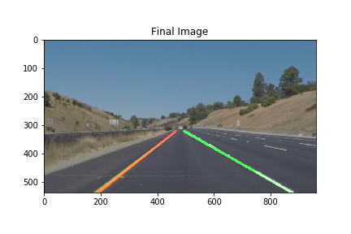

# **Assignment 1: Lane Line Detection** 

**ECE493:** Autonomous Vehicles

David Ferris (20553578)

djeferri@uwaterloo.ca

## **Part 1:** Pipeline Description
My pipeline consisted of 8 steps.  The pipeline will be demonstrated on the below image.

#### 1. HLS Color Section
The image was first converted from RGB to HLS (Hue, Lightness, Saturation).  HLS was selected because it provided the greatest contrast between the lane lines (both white and yellow) and the road.  HSV (Hue, Saturation, Value) was also considered, but as observed below, this colorspace does not provide good contrast between lane and road.

#### 2. White and Yellow Color Extraction
The lane lines glow bright blue and green in the HLS color space, depending on whether the lane is white or yellow.  Masks are applied which extract only the pixels which fall in some range around these colors.

#### 3. Grayscale
The image is then converted into grayscale.  This simplifies the problem, and reduces computational need since the number of image channels is decreased from three to one.

#### 4. Guassian Blur
A gaussian smoothing filter was then applied with a kernel size of 15.  This removes noise in the image but leaves the thicker edges relatively intact

#### 5. Canny Edge Detection
A Canny edge detector is then applied, which searched for contrasting edges in the image.  As is visible in the below figure, the bright lane markings form a clear edge against the grey road.

#### 6. Region of Interest
A trapezoidal region of interest (ROI) is used, with all edges outside this region removed.  From the camera angle, it can be assumed that lane lines will almost always fall within this region (we would not expect lanes in the sky, for ex).

#### 7. Hough Transform
A Hough Transform is applied, forming a list of predicted segments from the detected edges.  The number of detected segments varies between approximately 5 and 100, and the following step attempts to combine these into just 2 lane lines.

#### 8. Line Segment Combination
The final step in the pipeline is to combine the segments from the Hough Transform into two lane lines.  This required modification of the `draw_lines()` function.  First, the lines are split into two groups: left and right.  These two groups are then averaged into two individual lines by simply averaging the slope and y-intercept. The RANSAC algorithm was also prototyped (function included), but the simpler averaging technique proved sufficient.  This final segment is then linearly extrapolated between the middle and bottom of the image, forming predicted lane lines.

#### Final Image
The final image is shown with left and right lanes clearly detected.

### Parameters

| Pipeline Step        | Parameter      | Value     |
|----------------------|----------------|-----------|
| Gaussian Blur        | kernel_size    | 15        |
| Canny Edge Detection | low_threshold  | 50        |
| Canny Edge Detection | high_threshold | 140       |
| Region of Interest   | shape          | trapezoid |
| Hough Transform      | rho            | 1.0       |
| Hough Transform      | theta          | 1 degree  |
| Hough Transform      | threshold      | 15        |
| Hough Transform      | min_line_len   | 20        |
| Hough Transform      | max_line_gap   | 10        |

## **Part 2:** Potential Shortcomings
#### Fixed ROI and Number of Lanes
This implementation works extremely well when the car is situated between two lane lines.  It is unlikely to work well when the car changes lanes, or if more than two lanes are clearly visible.  More generally, this inflexibility criticism applies to all heuristic-based image processing pipelines: they don't work well in unexpected situations.

#### Other Lines on the Road
The main component of this pipeline is the edge detection and Hough Transform.  This works for the examples provided because the lane lines are the starkest linear edges.  Barriers, trucks, cracks in the road, signage and any number of other things could potentially be detected as lines, particularly those which are white or yellow.  This is already observed in the challenge where a crack in the road briefly appears as a lane line.

#### Confidence Level
At no point is a confiedence level assigned to the lane line prediction.  This could possibly be added in the line combination step, especially given that there is some expected lane direction, but at the moment the only pipeline output is the prediction itself.

## **Part 3:** Possible Improvements
The above shortcomings could be improved with the addition or more heuristics and parameter tuning, however the improvements discussed here are larger and more structural changes.

#### Temporal Filtering
Although the Gaussian filter smooths spacial noise in the image itself, the current implementation does not carry any memory about past lanes detected, treating each frame as unrelated to the previous one.  This is clearly not the case, and the lane lines are unlikely to change drastically between successive frames.

The simplest approach would be to apply a low pass filter in the time domain between detected line segments.  This would effectively average out lane predictions and fix the issue of noisy predictions in time (clearly observed in the video).

#### Lane Classifier
A binary classifier could be trained to identify segmented lanes.  Then, the lane line hypothesis produced by this pipeline could be used to crop the lanes out of the original image for inference in the lane classifier.  It is important to note that this binary model would not locate lanes within an image (called segmentation), and would only identify and already cropped lane line.  This would act as a secondary verification that the edge detected is an actual lane.

#### RANSAC
As mentioned in the pipeline description, a simple average is used instead of RANSAC.  In theory, RANSAC could improve the line combination step by removing outliers.  Outliers do occaionally skew the detected line (observed in the challenge video).
